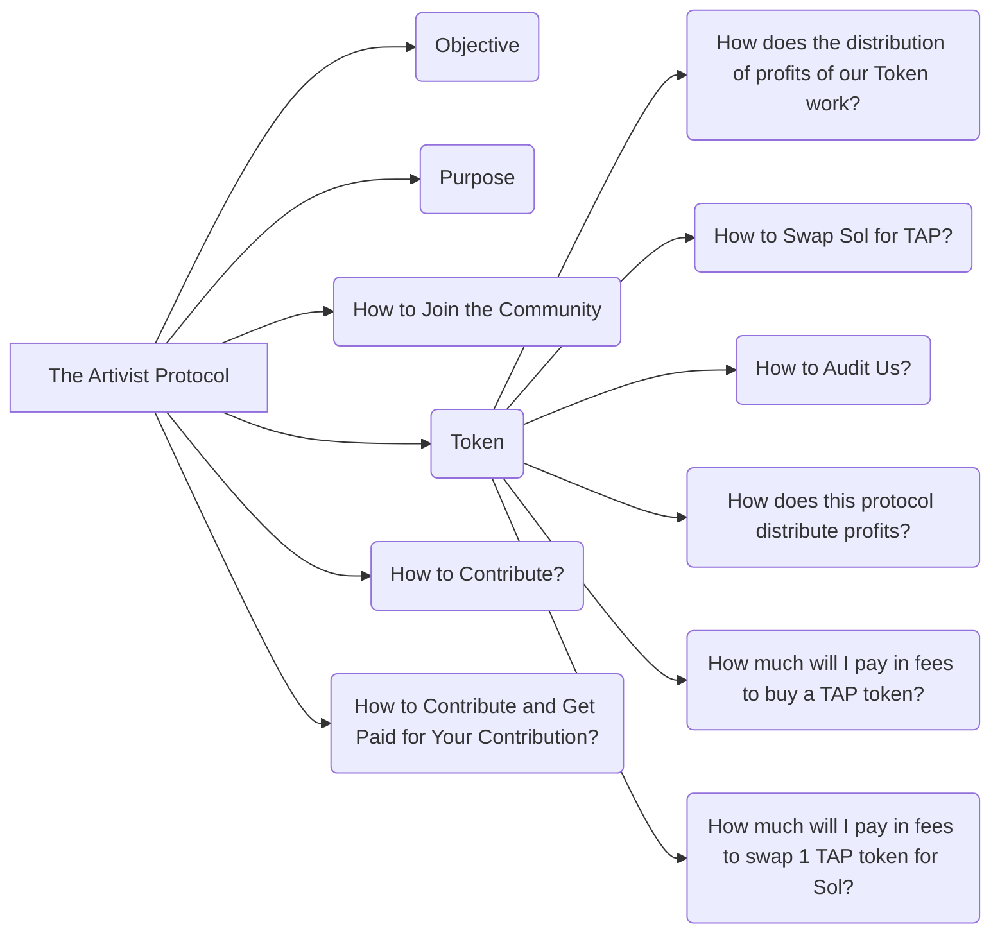

# The_Artivist_Protocol

## Objective

The objective of The Artivist Protocol is to create a decentralized ecosystem that empowers artists and activists, providing a platform where art and activism can merge to promote significant social changes. Our protocol utilizes blockchain technology to ensure transparency and fairness in resource distribution and decision-making.

## Purpose

Our purpose is to offer a viable alternative for artists and activists seeking financial support and recognition for their contributions to society. We aim to create an environment where creativity and activism are not only recognized but also fairly rewarded.

## How to Join the Community

To participate in The Artivist Protocol community, you can start by acquiring our governance tokens, TAP. These tokens enable you to participate in community decisions, propose new projects, and vote on existing initiatives.

## Token

### How does the distribution of profits of our Token work?

The distribution of TAP token profits is done proportionally to the amount of tokens each member holds. One-third of the tokens is reserved for creators, one-third for investors, and one-third for the DAO treasury, which funds new projects and covers operational costs.

### How to Swap Sol for TAP?

You can swap Sol for TAP through [Raydium](https://raydium.io/)
, where our token is listed. Simply add Sol to the corresponding liquidity pool to receive TAP in exchange, according to the current market rate.

### How to Audit Us?

Our DAO and protocol are completely transparent and blockchain-based. All smart contracts and transactions are publicly available for auditing. We encourage the community to review and audit our operations to ensure trust and transparency.

### How does this protocol distribute profits?

Profits are distributed proportionally among all TAP token holders. This includes the splitting of transaction fees and any other profits generated by the protocol.

### How much will I pay in fees to buy a TAP token?

The fees to buy a TAP token are the standard fees from [Raydium](https://raydium.io/)
, which vary depending on demand on the Ethereum network.

### How much will I pay in fees to swap 1 TAP token for Sol?

The fees to swap one TAP token for Sol are again the standard fees from [Raydium](https://raydium.io/)
 and depend on the network conditions at the time of the transaction.

## How to Contribute?

Contributions can be made through active participation in the community by proposing or voting on projects, or by providing liquidity in the [Raydium](https://raydium.io/)
 pool.

## How to Contribute and Get Paid for Your Contribution?

If you wish to contribute and get paid for your contribution, become a member by acquiring TAP tokens. You can pick up a card (task or project) to execute, and upon completion, you'll be rewarded in Sol. This process ensures that all contributors are fairly compensated for their efforts and talents.