# Artivist_DAO_growth.md

Este documento descreve a estratégia de crescimento e operação da Artivist DAO, incluindo detalhes sobre a visão geral do projeto, estratégia de tokens, utilidade dos tokens, governança, ferramentas por departamento, feedback e ajustes, e observações adicionais.

```mermaid
graph TD
    A[Artivist DAO]:::header --> B[Visão Geral]:::subheader
    B --> B1[Nome: Artivist DAO]:::info
    B --> B2[Objetivo: Integração entre Artistas e Ativistas]:::info
    B --> B3[Plataforma: Solana]:::info

    A --> C[Estratégia de Tokens]:::subheader
    C --> C1[Nome do Token: ArtivistCoin ARTV]:::info
    C --> C2[Tipo: Governance e Utility]:::info
    C --> C3[Quantidade Total: 1.000.000 ARTV]:::info
    C --> C4[Distribuição Inicial: 25%]:::info
    C --> C5[Métodos de Distribuição: ICO, Airdrops]:::info
    C --> C6[Modelo de Vesting: 4 anos, Cliff de 1 ano]:::info

    A --> D[Utilidade dos Tokens]:::subheader
    D --> D1[Acesso a Eventos Exclusivos]:::info
    D --> D2[Votação em Projetos]:::info
    D --> D3[Financiamento de Projetos]:::info

    A --> E[Governança]:::subheader
    E --> E1[Principais Ferramentas:]:::info
    E --> E2[Votação baseada em Tokens]:::info
    E --> E3[Sistema Proporcional de Votos]:::info
    E --> E4[Snapshot para Votações]:::info
    E --> E5[Aragon para Gestão DAO]:::info
    E --> E6[Boardroom para Governança DeFi]:::info
    E --> E7[DAOhaus para Colaboração]:::info

    A --> F[Departamentos e Ferramentas]:::subheader
    F --> F1[Legal e Regulamentações]:::subheader2
    F1 --> F1A[Conformidade com Regulamentos]:::info
    F1 --> F1B[Consultoria Legal]:::info
    F --> F2[Tecnologia e Segurança]:::subheader2
    F2 --> F2A[Blockchain Solana]:::info
    F2 --> F2B[OpenZeppelin para Contratos]:::info
    F2 --> F2C[Chainalysis para Análises]:::info
    F2 --> F2D[Halborn Security para Auditorias]:::info
    F --> F3[Comunicação e Marketing]:::subheader2
    F3 --> F3A[Parcerias com Influenciadores]:::info
    F3 --> F3B[Campanhas em Redes Sociais]:::info
    F3 --> F3C[Participação em Conferências]:::info
    F3 --> F3D[Discord para Comunicação Interna]:::info
    F3 --> F3E[Mailchimp para Newsletters]:::info
    F3 --> F3F[Hootsuite para Gestão de Redes Sociais]:::info
    F --> F4[Financeiro]:::subheader2
    F4 --> F4A[QuickBooks para Contabilidade]:::info
    F4 --> F4B[Coinbase para Gestão de Criptomoedas]:::info
    F4 --> F4C[Gnosis Safe para Tesouraria]:::info
    F4 --> F4D[Defi Pulse para Monitoramento]:::info
    F --> F5[Auditoria]:::subheader2
    F5 --> F5A[Smart Contract Auditorias]:::info
    F5 --> F5B[Certik para Segurança]:::info
    F5 --> F5C[Quantstamp para Verificação]:::info
    F --> F6[Certificação]:::subheader2
    F6 --> F6A[Certificação de Projetos e Artistas]:::info
    F6 --> F6B[Dapper Labs para NFTs]:::info
    F6 --> F6C[Verisart para Certificação Digital]:::info

    A --> G[Feedback e Ajustes]:::subheader
    G --> G1[Avaliação Contínua]:::info
    G --> G2[Reuniões Trimestrais]:::info

    A --> H[Observações Adicionais]:::subheader
    H --> H1[Colaborações e Parcerias para Impacto Social]:::info

    classDef header fill:#f9d342,stroke:#333,stroke-width:4px;
    classDef subheader fill:#f4b400,stroke:#333,stroke-width:3px;
    classDef subheader2 fill:#f4a460,stroke:#333,stroke-width:3px;
    classDef info fill:#e8e8e8,stroke:#333,stroke-width:2px;

```

## Artivist DAO: Estratégia de Crescimento e Operação
### 1. Visão Geral da Artivist DAO
- **Nome:** Artivist DAO
- **Objetivo:** Promover a integração e o apoio entre artistas e ativistas através de tecnologias descentralizadas.
- **Plataforma Utilizada:** Solana

### 2. Estratégia de Tokens
- **Nome do Token:** ArtivistCoin (ARTV)
- **Tipo de Token:** Governance e Utility
- **Quantidade Total:** 1.000.000 de ARTV
- **Distribuição Inicial:** 25%
- **Métodos de Distribuição:** ICO e Airdrops para Membros Iniciais
- **Modelo de Vesting:** Vesting de 4 anos com cliff de 1 ano, acúmulo mensal após 1 ano

### 3. Utilidade dos Tokens
- Acesso a eventos exclusivos
- Votação em projetos da DAO
- Financiamento de projetos artísticos e ativistas

### 4. Governança
- **Principais Ferramentas:**
  - Votação baseada em tokens
  - Sistema proporcional de votos
  - Snapshot para votações
  - Aragon para gestão da DAO
  - Boardroom para governança DeFi
  - DAOhaus para colaboração

### 5. Departamentos e Ferramentas
#### 5.1 Legal e Regulamentações
- Conformidade com regulamentos internacionais
- Consultoria legal especializada

#### 5.2 Tecnologia e Segurança
- Blockchain Solana
- OpenZeppelin para contratos inteligentes
- Chainalysis para análise de transações
- Halborn Security para auditorias de segurança

#### 5.3 Comunicação e Marketing
- **Parcerias com Influenciadores:**
  - Realização de Campanhas de Marketing específicas
  - Engajamento ativo da Comunidade
- **Campanhas em Redes Sociais:**
  - Desenvolvimento de Estratégia de Conteúdo coerente com a missão da DAO
  - Gerenciamento eficiente de Publicações e interações nas redes
- **Participação em Conferências:**
  - Foco em Networking para expandir influência e parcerias
  - Realização de Apresentações e Palestras para divulgar a DAO
- **Discord para Comunicação Interna:**
  - Manutenção de Canais de Comunicação claros e eficientes
  - Organização de Eventos e Reuniões Virtuais para membros
- **Mailchimp para Newsletters:**
  - Criação e Distribuição de Newsletters informativas
  - Análise de engajamento e alcance das newsletters
- **Hootsuite para Gestão de Redes Sociais:**
  - Agendamento de Publicações para otimizar o alcance
  - Análise detalhada de Desempenho das campanhas

#### 5.4 Financeiro
- QuickBooks para contabilidade
- Coinbase para gestão de criptomoedas
- Gnosis Safe para gestão de tesouraria
- Defi Pulse para monitoramento de mercado

#### 5.5 Auditoria
- Smart Contract Auditorias
- Certik para segurança de blockchain
- Quantstamp para verificação de segurança

#### 5.6 Certificação
- Certificação de projetos e artistas
- Dapper Labs para certificados NFT
- Verisart para certificação digital

### 6. Feedback e Ajustes
- Avaliação contínua através de feedback da comunidade
- Reuniões trimestrais para revisão de estratégias

### 7. Observações Adicionais
- Planos para colaborações e parcerias com organizações de arte e ativismo para ampliar o impacto social da DAO.